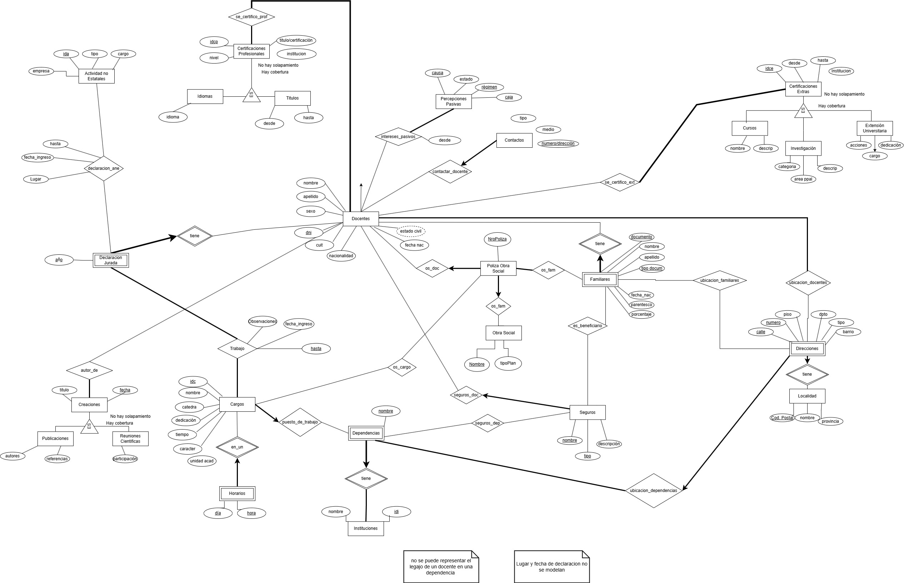

## Diagrama

## Entidades

### Docente
- Nombre
- Apellido
- Sexo
- CUIT/CUIL
- DNI
- Nacionalidad
- Estado civil
- Fecha de nacimiento

### Familiar (Débil de Docente)
- Apellido
- Nombre
- Parentesco
- Tipo de documento
- Número de documento
- Fecha de nacimiento
- Obra social

### Localidad
- Nombre
- Provincia
- Código postal

### Direcciones
- Tipo
- Calle
- Número
- Piso
- Dpto
- Barrio

### Contactos
- Tipo
- Medio
- Número/Dirección

### Idiomas
- Idioma
- Nivel
- Certificación

### Instituciones/Repartición
- Nombre

### Títulos
- Nivel
- Título
- Desde
- Hasta

### Cursitos
- Nombre
- Descripción
- Desde
- Hasta

### Antecedentes Profesionales
- Desde
- Hasta
- Cargo
- Actividad
- Empresa

### Investigación
- Categoría
- Área principal
- Dedicación
- Desde
- Hasta

### Extensión Universitaria
- Acciones a cargo
- Dedicación
- Desde
- Hasta

### Publicaciones
- Título
- Autores
- Referencia bibliográfica
- Año

### Reuniones Científicas
- Título
- Participación
- Fecha

### Cargos
- IDC
- Nombre
- Cátedra
- Dedicación
- Tiempo (Completo o Reducido)
- Carácter
- Estado (Ejercido o no)

### Horarios (Débil de Cargos)
- Día
- Hora

### Seguros
- Nombre aseguradora
- Tipo
- Descripción

### Pasivos
- Causa
- Estado
- Régimen
- Caja

### Dependencia
- Nombre
- Obra social

## Relaciones

### Docente - Institución
- Fecha de ingreso

### Docente - Actividades No Estatales
- Fecha de ingreso

### Docente - Pasivos
- Fecha desde

### Seguros - Docentes (Agregación)
- Un docente contrata un seguro
- Puede o no tener una dependencia

### Relación Ternaria: Docente - Cargo - Dependencia
- Fecha ingreso
- Fecha egreso
- Legajo

### Relación Familiar - Seguro
- Porcentaje

## Supuestos
1. Se supone que todos los docentes que trabajen en una dependencia tienen la misma obra social.
2. Los mismos beneficiarios de la obra social serán los mismos beneficiarios del seguro de vida.
3. Se considera a Repartición como institución.
4. Lugar y fecha (DDJJ de cargo, en la sección “Certifico que los datos consignados son exactos”) no se modelan.
